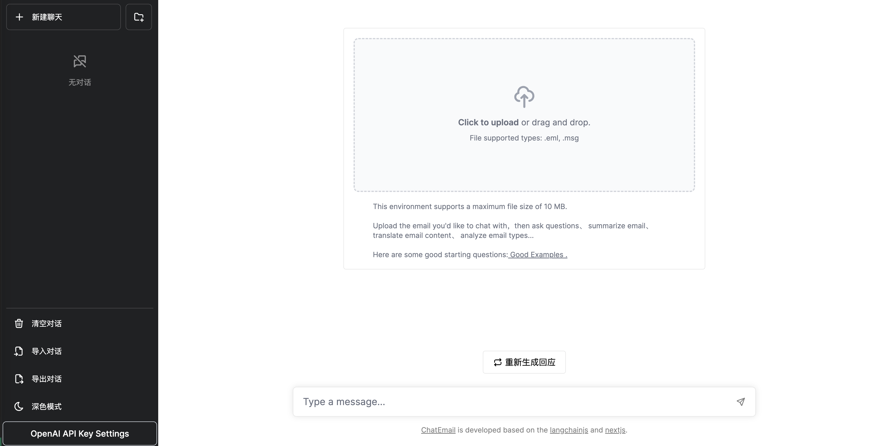
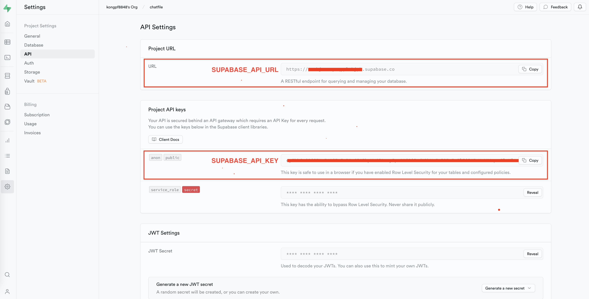

<div align="center">
  
<h1 align="center">ChatEmail</h1>

[](./LICENSE)

和邮件对话😎，提取邮件摘要、翻译邮件、分析邮件类型、生成邮件回复等

项目基于🦜️🔗[LangchainJS](https://github.com/hwchase17/langchainjs) 和 [ChatFiles](https://github.com/guangzhengli/ChatFiles) 构建

</div>

## 流程


## 截图


## 使用

### 😊初始化向量数据库(Supabase)
- 注册Supabase账户
  
  🔗 [https://supabase.com/](https://supabase.com/)
  
- 创建一个新项目
  
  获取`SUPABASE_API_URL`和`SUPABASE_API_KEY`
  
  

- 创建数据库表

  在数据库中运行以下语句:
  
  ```sql
    -- Enable the pgvector extension to work with embedding vectors
    create extension vector;
    
    -- Create a table to store your documents
    create table documents (
      id bigserial primary key,
      content text, -- corresponds to Document.pageContent
      metadata jsonb, -- corresponds to Document.metadata
      embedding vector(1536) -- 1536 works for OpenAI embeddings, change if needed
    );
    
    -- Create a function to search for documents
    create function match_documents (
      query_embedding vector(1536),
      match_count int DEFAULT null,
      filter jsonb DEFAULT '{}'
    ) returns table (
      id bigint,
      content text,
      metadata jsonb,
      similarity float
    )
    language plpgsql
    as $$
    #variable_conflict use_column
    begin
      return query
      select
        id,
        content,
        metadata,
        1 - (documents.embedding <=> query_embedding) as similarity
      from documents
      where metadata @> filter
      order by documents.embedding <=> query_embedding
      limit match_count;
    end;
    $$;
    ```

### 😏设置环境变量
1. 在代码根目录生成.env文件
  ```shell
  cp .env.sample .env
  ```
2. 设置.env文件中的环境变量

| 名称                     | 描述                                                                                                               | 默认值                           |
|------------------------|------------------------------------------------------------------------------------------------------------------|-------------------------------|
| NEXT_PUBLIC_CHAT_FILES_UPLOAD_PATH     | 上传文件的存放路径                              | public/uploads                             |
| NEXT_PUBLIC_CHAT_FILES_MAX_SIZE  | 上传文件的最大值，单位为字节，如果不设置或设置为0，则表示没有限制                            | 0 |
| SUPABASE_API_URL | Supabase的API地址，格式如https://xxxx.supabase.co                                          |          |
| SUPABASE_API_KEY | Supabase的API密钥 ||
| OPENAI_TYPE | OPENAI的类型，取值为OPENAI或AZURE_OPENAI        |OPENAI|
| OPENAI_API_KEY | OPENAI的密钥       ||
| OPENAI_API_MODEL | OPENAI的模型名称，如gpt-3.5-turbo、gpt-3.5-turbo-16k       |gpt-3.5-turbo|
| AZURE_OPENAI_API_DEPLOYMENT_NAME | AZURE OPENAI的部署名称      ||
| AZURE_OPENAI_API_EMBEDDINGS_DEPLOYMENT_NAME | AZURE OPENAI的嵌入模型部署名称 ||
| AZURE_OPENAI_API_INSTANCE_NAME | AZURE OPENAI的实例名称 ||
| AZURE_OPENAI_API_VERSION | AZURE OPENAI的API版本|2023-03-15-preview|
   
### 😁本地运行
执行以下命令：
```shell
npm install

npm run dev
```
打开浏览器，访问[http://localhost:3000](http://localhost:300)

### Docker部署

构建镜像

```shell
docker build -t chatemail .
```

运行

```shell
docker run -d -p 3000:3000 \
  --name chatemail \
  --env NEXT_PUBLIC_CHAT_FILES_MAX_SIZE=10000000 \
  --env NEXT_PUBLIC_CHAT_FILES_UPLOAD_PATH=public/uploads \
  --env SUPABASE_API_URL=${SUPABASE_API_URL} \
  --env SUPABASE_API_KEY=${SUPABASE_API_KEY} \
  --env OPENAI_TYPE=OPENAI \
  --env OPENAI_API_KEY=${OPENAI_API_KEY} \
  --env OPENAI_API_MODEL=gpt-3.5-turbo \
  chatemail:latest
```

或者

```shell
docker run -d -p 3000:3000 \
  --name chatemail \
  --env NEXT_PUBLIC_CHAT_FILES_MAX_SIZE=10000000 \
  --env NEXT_PUBLIC_CHAT_FILES_UPLOAD_PATH=public/uploads \
  --env SUPABASE_API_URL=${SUPABASE_API_URL} \
  --env SUPABASE_API_KEY=${SUPABASE_API_KEY} \
  --env OPENAI_TYPE=AZURE_OPENAI \
  --env AZURE_OPENAI_API_KEY=${AZURE_OPENAI_API_KEY} \
  --env AZURE_OPENAI_API_DEPLOYMENT_NAME=${AZURE_OPENAI_API_DEPLOYMENT_NAME} \
  --env AZURE_OPENAI_API_EMBEDDINGS_DEPLOYMENT_NAME=${AZURE_OPENAI_API_EMBEDDINGS_DEPLOYMENT_NAME} \
  --env AZURE_OPENAI_API_INSTANCE_NAME=${AZURE_OPENAI_API_INSTANCE_NAME} \
  --env AZURE_OPENAI_API_VERSION=2023-03-15-preview \
  chatemail:latest
```
### Docker compose 部署

docker-compose.yml文件如下：

```yaml

version: '3'

services:
  chat-email:
    image: rainboy2010/chatemail:latest
    container_name: chatemail
    ports:
      - 3000:3000
    environment:
      NEXT_PUBLIC_CHAT_FILES_MAX_SIZE: 10000000
      NEXT_PUBLIC_CHAT_FILES_UPLOAD_PATH: public/uploads
      # supabase parameters
      SUPABASE_API_URL: <SUPABASE_API_URL>
      SUPABASE_API_KEY: <SUPABASE_API_KEY>
      OPENAI_TYPE: OPENAI
      # if OPENAI_TYPE=OPENAI,please fill below openai parameters
      OPENAI_API_KEY: <OPENAI_API_KEY>
      OPENAI_API_MODEL: gpt-3.5-turbo
      # if OPENAI_TYPE=AZURE_OPENAI,please fill below azure openai parameters
      AZURE_OPENAI_API_KEY: <AZURE_OPENAI_API_KEY>
      AZURE_OPENAI_API_DEPLOYMENT_NAME: <>
      AZURE_OPENAI_API_EMBEDDINGS_DEPLOYMENT_NAME: xxx
      AZURE_OPENAI_API_INSTANCE_NAME: xxx
      AZURE_OPENAI_API_VERSION: 2023-03-15-preview
```

运行：

```shell
docker compose up -d
```
