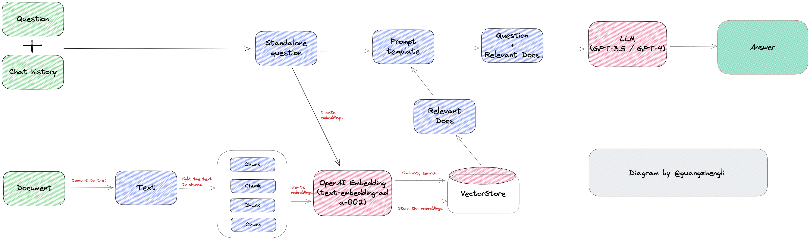
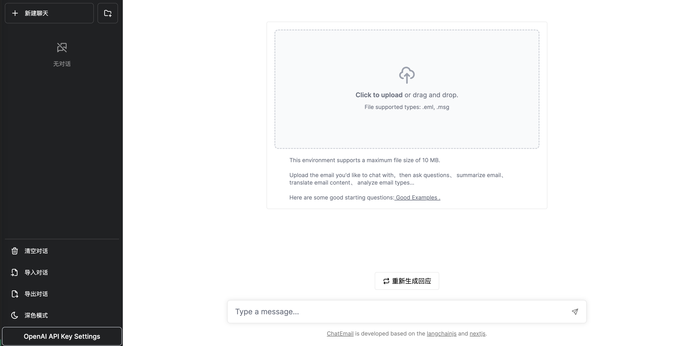
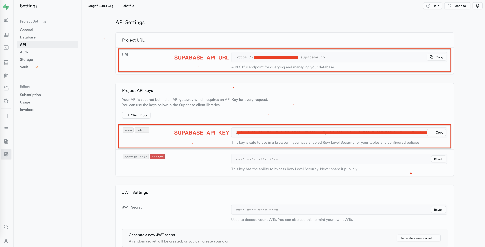

<div align="center">
  
<h1 align="center">ChatEmail</h1>

[](./LICENSE)

English | [中文](./README.md)

Conversation to Email 😎, Summary Email , Translate Email, Analyze Email Types, Generate Email Reply, etc.

The project is built on 🦜️🔗[LangchainJS](https://github.com/hwchase17/langchainjs) and [ChatFiles](https://github.com/guangzhengli/ChatFiles)

</div>

## Flow


## Screenshot


## Use

### 😊Initializes the vector database(Supabase)
- Register a Supabase account
  
  🔗 [https://supabase.com/](https://supabase.com/)
  
- Create a new project
  
  Get `SUPABASE_API_URL` and `SUPABASE_API_KEY`
  
  

- Create database table

  Run this in your database:
  
  ```sql
    -- Enable the pgvector extension to work with embedding vectors
    create extension vector;
    
    -- Create a table to store your documents
    create table documents (
      id bigserial primary key,
      content text, -- corresponds to Document.pageContent
      metadata jsonb, -- corresponds to Document.metadata
      embedding vector(1536) -- 1536 works for OpenAI embeddings, change if needed
    );
    
    -- Create a function to search for documents
    create function match_documents (
      query_embedding vector(1536),
      match_count int DEFAULT null,
      filter jsonb DEFAULT '{}'
    ) returns table (
      id bigint,
      content text,
      metadata jsonb,
      similarity float
    )
    language plpgsql
    as $$
    #variable_conflict use_column
    begin
      return query
      select
        id,
        content,
        metadata,
        1 - (documents.embedding <=> query_embedding) as similarity
      from documents
      where metadata @> filter
      order by documents.embedding <=> query_embedding
      limit match_count;
    end;
    $$;
    ```

### 😏Set environment variables
1. Generate the.env file in the project root
  ```shell
  cp .env.sample .env
  ```
2. Set the environment variables in the.env file

| Name                     | Description                                                                                                               | Default value                           |
|------------------------|------------------------------------------------------------------------------------------------------------------|-------------------------------|
| NEXT_PUBLIC_CHAT_FILES_UPLOAD_PATH     | the path for store uploaded files                              | public/uploads                             |
| NEXT_PUBLIC_CHAT_FILES_MAX_SIZE  | The maximum size of file to be uploaded, in bytes. If this parameter is not set or is set to 0, there is no limit                            | 0 |
| SUPABASE_API_URL | API endpoint for Supabase，format is:https://xxxx.supabase.co                                          |          |
| SUPABASE_API_KEY | API key for Supabase ||
| OPENAI_TYPE | The type for OPENAI，OPENAI or AZURE_OPENAI        |OPENAI|
| OPENAI_API_KEY | API key for OPENAI       ||
| OPENAI_API_MODEL | The model name for OPENAI，such gpt-3.5-turbo、gpt-3.5-turbo-16k       |gpt-3.5-turbo|
| AZURE_OPENAI_API_KEY | API key for AZURE OPENAI        ||
| AZURE_OPENAI_API_DEPLOYMENT_NAME | The deployment name for AZURE OPENAI       ||
| AZURE_OPENAI_API_EMBEDDINGS_DEPLOYMENT_NAME | The embedded model deployment name for AZURE OPENAI ||
| AZURE_OPENAI_API_INSTANCE_NAME | The instance name for AZURE OPENAI  ||
| AZURE_OPENAI_API_VERSION | The API version for AZURE OPENAI|2023-03-15-preview|
   
### 😁Local run

Run the following command:

```shell
npm install

npm run dev
```
Open your browser and visit [http://localhost:3000](http://localhost:300)

### Deploy by docker 

```shell
docker run -d -p 3000:3000 \
  --name chatemail \
  --env NEXT_PUBLIC_CHAT_FILES_MAX_SIZE=10000000 \
  --env NEXT_PUBLIC_CHAT_FILES_UPLOAD_PATH=public/uploads \
  --env SUPABASE_API_URL=${SUPABASE_API_URL} \
  --env SUPABASE_API_KEY=${SUPABASE_API_KEY} \
  --env OPENAI_TYPE=OPENAI \
  --env OPENAI_API_KEY=${OPENAI_API_KEY} \
  --env OPENAI_API_MODEL=gpt-3.5-turbo \
  rainboy2010/chatemail:latest
```

or

```shell
docker run -d -p 3000:3000 \
  --name chatemail \
  --env NEXT_PUBLIC_CHAT_FILES_MAX_SIZE=10000000 \
  --env NEXT_PUBLIC_CHAT_FILES_UPLOAD_PATH=public/uploads \
  --env SUPABASE_API_URL=${SUPABASE_API_URL} \
  --env SUPABASE_API_KEY=${SUPABASE_API_KEY} \
  --env OPENAI_TYPE=AZURE_OPENAI \
  --env AZURE_OPENAI_API_KEY=${AZURE_OPENAI_API_KEY} \
  --env AZURE_OPENAI_API_DEPLOYMENT_NAME=${AZURE_OPENAI_API_DEPLOYMENT_NAME} \
  --env AZURE_OPENAI_API_EMBEDDINGS_DEPLOYMENT_NAME=${AZURE_OPENAI_API_EMBEDDINGS_DEPLOYMENT_NAME} \
  --env AZURE_OPENAI_API_INSTANCE_NAME=${AZURE_OPENAI_API_INSTANCE_NAME} \
  --env AZURE_OPENAI_API_VERSION=2023-03-15-preview \
  rainboy2010/chatemail:latest
```
### Deploy by docker compose

docker-compose.yml file is：

```yaml

version: '3'

services:
  chat-email:
    image: rainboy2010/chatemail:latest
    container_name: chatemail
    ports:
      - 3000:3000
    environment:
      NEXT_PUBLIC_CHAT_FILES_MAX_SIZE: 10000000
      NEXT_PUBLIC_CHAT_FILES_UPLOAD_PATH: public/uploads
      # supabase parameters
      SUPABASE_API_URL: <SUPABASE_API_URL>
      SUPABASE_API_KEY: <SUPABASE_API_KEY>
      OPENAI_TYPE: OPENAI
      # if OPENAI_TYPE=OPENAI,please fill below openai parameters
      OPENAI_API_KEY: <OPENAI_API_KEY>
      OPENAI_API_MODEL: gpt-3.5-turbo
      # if OPENAI_TYPE=AZURE_OPENAI,please fill below azure openai parameters
      AZURE_OPENAI_API_KEY: <AZURE_OPENAI_API_KEY>
      AZURE_OPENAI_API_DEPLOYMENT_NAME: <AZURE_OPENAI_API_DEPLOYMENT_NAME>
      AZURE_OPENAI_API_EMBEDDINGS_DEPLOYMENT_NAME: <AZURE_OPENAI_API_EMBEDDINGS_DEPLOYMENT_NAME>
      AZURE_OPENAI_API_INSTANCE_NAME: <AZURE_OPENAI_API_INSTANCE_NAME>
      AZURE_OPENAI_API_VERSION: 2023-03-15-preview
```

Run：

```shell
docker compose up -d
```
